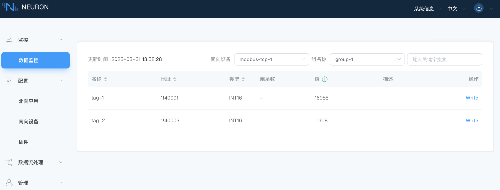
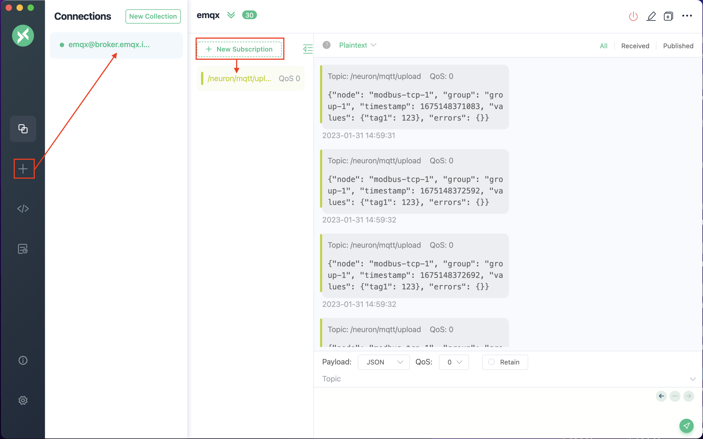

# Quick Start

This document requires that you have successfully run Neuron according to the [Installation and Operation](https://github.com/emqx/neuron/README.md) guide, and that you can open the Neuron management panel in your browser.

## Start the Modbus TCP Simulator

Two types of Modbus TCP simulators are provided. You can run one of them according to your needs.

### Neuron's Built-in Simulator

The Neuron source code or release package includes a test simulator that runs on Linux, which can read and write some fixed points. The Slave ID is 1.

```bash
# If compiling from source, it's in the build/simulator directory
# In the release package, it's in the root directory

# Run the Modbus simulator, use TCP mode, and bind to 0.0.0.0:1502
$ ./modbus_simulator tcp 1502 ip_v4
```

### PeakHMI Slave Simulators

The PeakHMI simulator needs to run on a Windows system. [PeakHMI Official Website](https://hmisys.com)

After downloading and installing, run the Modbus TCP slave EX simulator. The default port for this simulator is 502, which will be blocked by the default Windows firewall. Make sure the firewall allows this port or disable the firewall.


## Create a Southbound Device in Neuron

### Create a Device

**Southbound Device Management** -> **Add Device**. In the pop-up dialog box, fill in the device information and create the device. Select `Modbus TCP` for the **Plugin** and enter `modbus-tcp-1` for the **Name**.

### Configure the Device
After creating the device, go to the device details page to configure the device parameters.

**IP Address**: Fill in the IP address of the machine running the Modbus TCP simulator. If Neuron and the simulator are running on the same machine, you can enter `127.0.0.1`.
**Port**: The default is 502. Modify it according to the listening port of the simulator.

Other parameters can be left as default.

### Configure Data Points

On the **Southbound Device Management** page, click the **Device Name** to enter the group page. Add a group and name it `group1`.

After entering the group, click the **Group Name** to enter the tag configuration page and create a tag.


**Name**: `tag-1`
**Address**: `1!40001` (Slave ID 1, holding register 40001)
**Attribute**: `Read` and `Write`
**Data Type**: `INT16`

### View Tag Values

After configuring the tags, go to the **Data Monitoring** page, select the device and group you just created, and you will see the values of the tags.



## Create a Northbound Application

Use MQTT to send the data collected from the Modbus device to an MQTT Broker.

**Northbound Application Management** -> **Add Application**. In the pop-up dialog box, fill in the application information to create the application.
Select `MQTT` for the **Plugin** and enter `mqtt` for the **Name**.

### Configure the Northbound Application

After creating the northbound application, go to the northbound configuration page. The default server address is `broker.emqx.io` and the port is `1883`. If you need to connect to another MQTT Broker, please modify it according to the actual situation.

### Subscribe to Southbound Data Groups

On the **Northbound Application Management** page, click the northbound application to enter the **Subscription Management** page. Click **Add Subscription**, and in the pop-up dialog box, select the Modbus device and group you just created.


Remember the topic used for the subscription, as you will need to subscribe to this topic later to see the data. The default topic format is `/neuron/{application_name}`.

At this point, the configuration for Neuron to collect data via Modbus TCP and send it via MQTT is complete.

## Use MQTTX to Subscribe to the Topic and View Data

After subscribing, open [MQTTX](https://mqttx.app/zh), create a new connection, and connect to `broker.emqx.io:1883` (modify according to the MQTT broker configured in the northbound application).

After a successful connection, subscribe to the topic `/neuron/mqtt` (modify according to the topic used in the northbound subscription), and you will see the tag data.


