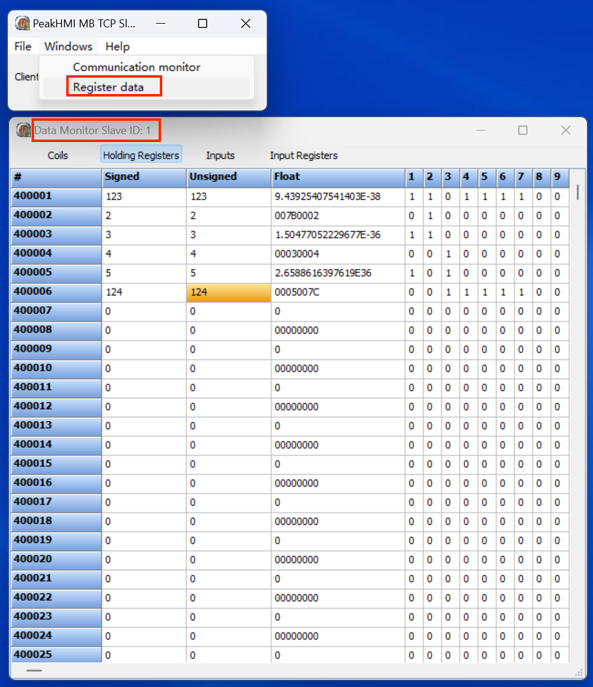

# 快速开始

本文档需要先根据 [安装运行](https://github.com/emqx/neuron/README-CN.md) 成功运行 Neuron，并且能通过浏览器打开 Neuron 的管理面板。

## 启动 Modbus TCP 模拟器

提供两种 Modbus TCP 模拟器，根据情况运行一种模拟器即可。

### Neuron 自带模拟器

Neuron 源码或 Release 中自带了在 Linux 上运行的测试模拟器，可以读写一些固定点位。Slave ID 为 1。

```bash
# 通过源码编译的方式，build/simulator 目录下
# Release 包中 simulator 目录下

# 运行 Modbus 模拟器，使用 TCP 模式，绑定 0.0.0.0:1502
$ ./modbus_simulator tcp 1502 ip_v4
```

### PeakHMI Slave Simulators 模拟器

PeakHMI 模拟器需要在 Windows 系统中运行，[PeakHMI 官网](https://hmisys.com)

下载并安装后，运行 Modbus TCP slave EX 模拟器即可，该模拟器默认绑定的端口为 502，会被 Windows 默认的防火墙拦截，确保防火墙能开放此接口或关闭防火墙。



## Neuron 中创建南向设备

### 创建设备

**南向设备管理** -> **添加设备** 在弹出的对话框中填写设备信息后创建设备，**插件** 选择 `Modbus TCP`，**名称** 填写 `modbus-tcp-1` 即可。

### 配置设备
创建设备后，进入设备详情页面配置设备参数。

**IP 地址**: 填写 Modbus TCP 模拟器运行机器的 IP 地址。如果 Neuron 与模拟器运行在同一台机器上，可以填写 `127.0.0.1`。
**端口**: 默认502，根据模拟器的监听端口进行修改。

其他参数默认即可。

### 配置数据点

在 **南向设备管理** 页面，点击 **设备名称** 进入点位组页面，添加一个点位组，名称填写 `group1` 即可。

进入点位组后，点击 **组名称** 进入点位配置页面，创建点位。


**名称**: `tag-1`
**地址**: `1!40001` ( Slave ID 1, 保持寄存器40001 )
**属性**: `Read` 与 `Write`
**数据类型**: `INT16`

### 查看点位值

配置完点位后，进入 **数据监控** 页面，选择刚才创建的设备以及点位组，即可看到点位的值。


## 创建北向应用

使用 MQTT，把刚才 modbus 设备中采集到的数据发送到 MQTT Broker。

**北向应用管理** -> **添加应用**，在弹出的对话框中填写应用信息创建应用。
**插件** 选择 `MQTT`，**名称** 填写 `mqtt` 即可。

### 配置北向应用

创建北向应用后，进入北向配置页面，默认服务器地址为 `broker.emqx.io`，端口为 `1883`，如果需要连接其他 MQTT Broker，请根据实际情况修改。

### 订阅南向数据组

在**北向应用管理**页面中，点击北向应用，进入**订阅管理**页面，点击**添加订阅**，在弹出的对话框中选择刚才创建的 Modbus 设备以及点位组。


记住订阅时的 topic，后续订阅该 topic 即可看到数据。topic 默认格式为`/neuron/{应用名称}`

至此，Neuron 的 Modbus TCP 采集数据并通过 MQTT 发送数据的配置完成。

## 使用 MQTTX 订阅 topic 查看数据

订阅完成后，打开 [MQTTX](https://mqttx.app/zh)，创建一个新的连接，连接到 `broker.emqx.io:1883`(根据北向应用配置的 MQTT broker 修改)。

连接成功后，订阅 topic `/neuron/mqtt` (根据北向订阅时的 topic 修改)，即可看到点位数据。

